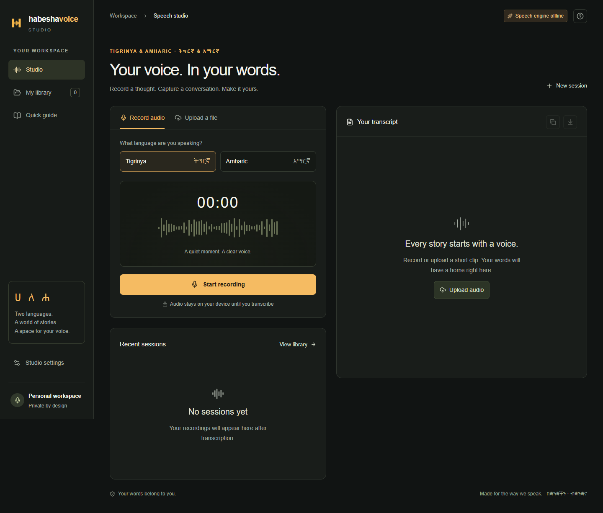

# HabeshaVoice Studio

A private, responsive speech workspace for **Tigrinya and Amharic**. Record or upload short audio, review editable Ethiopic transcripts, preserve the original, and export your words.

## What works

- Professional desktop and mobile UI with a custom brand mark.
- Browser recording, playback, file previews, and explicit upload consent.
- Private D1-backed transcript library and R2 audio storage.
- Editable titles/transcripts, immutable original, copy, UTF-8 TXT/Markdown export, print/PDF.
- Authenticated APIs, ownership checks, same-origin writes, bounded uploads and inference.
- Separate FastAPI service using Meta Omnilingual ASR, audio decoding and bounded chunks.
- TypeScript checks, validation tests, API smoke tests, Python tests, GitHub Actions.

## Release status

**The app is published, but real transcription requires deploying the inference service and setting two server secrets.**

No model is bundled in the web deployment. The app does not generate placeholder transcripts. It reports when the speech engine is not configured.

Speech accuracy has **not been measured** on representative, native-speaker-reviewed data. Dialect recognition, translation, summaries, live streaming, and offline ASR are not included. This is a production-oriented first release, not a claim of completed production acceptance.

## Local development

Requires Node.js 24, npm and Git. Use Python 3.12 for inference; a Linux GPU host is recommended for the model.

~~~sh
npm ci
npm run build
npm run db:local
npm run dev
~~~

Open the printed local URL, normally http://localhost:5173. The protected page uses the starter's loopback-only development sign-in. Local mock identity is excluded from production.

~~~sh
npm run typecheck
npm test
npm run test:api
~~~

The API smoke test requires the running local server and initialized database. It creates and deletes its own test record.

## Architecture

~~~text
Browser recording / upload
    |
Sites authenticated React + Vinext / Cloudflare Worker
    |-- D1: owned transcripts, daily inference quota
    |-- R2: private original audio
    |
    | HTTPS + server-only bearer secret
    v
FastAPI -> FFmpeg -> mono 16 kHz chunks -> Omnilingual ASR
    |
Validated text + duration -> private library -> user review
~~~

The first release uses a bounded HTTP request with a 180-second timeout, not a durable job queue. Each inference process handles one model job and rejects extra work with 429. Add a durable queue and measured capacity plan before higher traffic.

## Connect transcription

See [deployment instructions](docs/DEPLOYMENT.md).

1. Deploy the inference service behind HTTPS on suitable infrastructure.
2. Set a random ASR_API_KEY of at least 32 characters on the service.
3. Set the app's server-only ASR_ENDPOINT to the full /v1/transcribe URL and ASR_API_KEY to the same secret.
4. Verify health, then test real recordings in both languages end to end.
5. Measure accuracy, correction time, latency and cost before expanding access.

Never expose the secret in browser code, Git, public environment variables or query strings.

## Limits and privacy

Five minutes and 25 MB per recording; 100 library sessions per user; 20 transcription attempts per user per UTC day. Decode-time duration is authoritative.

Audio stays on the device until the user consents and clicks Transcribe. Successful recordings remain private with their transcript until deleted. Temporary inference files are cleaned up. This app does not train models from recordings.

Exports contain current edited text. PDF uses the browser's print dialog and Ethiopic font support.

## Evaluate accuracy

~~~sh
python scripts/benchmark.py evaluation.jsonl
~~~

Each line has language (ti or am), reference, and hypothesis. The script reports WER and CER separately by language. It uses NFC and whitespace normalization without merging Ethiopic characters. Use held-out speakers, native-speaker-checked references, and recordings covering regional speech, names, numbers, noise and English mixing.

## Security and verification

Read [SECURITY.md](SECURITY.md) and [verification results](docs/VERIFICATION.md). Production identity comes from the trusted Sites dispatcher. Do not expose a separately hosted Worker behind a gateway that accepts forged identity headers.

## Sources and licenses

- [Omnilingual ASR](https://github.com/facebookresearch/omnilingual-asr)
- [Model card](https://huggingface.co/facebook/omniASR-LLM-300M)
- [Supported language IDs](https://github.com/facebookresearch/omnilingual-asr/blob/main/src/omnilingual_asr/models/wav2vec2_llama/lang_ids.py)
- Logo: original generated asset created for this project.
- App code: MIT. Third-party code and model weights retain their own licenses. The vendored Sites build plugin retains its license in build/sites-vite-plugin.LICENSE.

No datasets, private recordings, credentials or model weights are committed.

